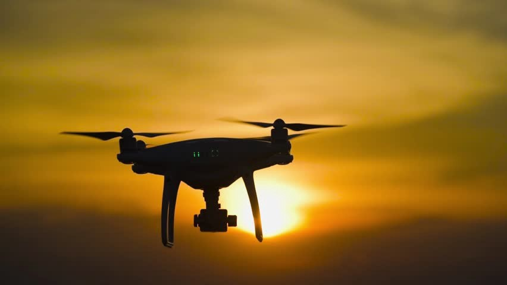

### Overview:

Camera and machine vision technology is gaining huge popularity among the tech lovers. When it comes to drones, the biggest factor which makes a drone different than other unmanned aerial vehicles is a Camera. Now, when we talk about a GoPro was founded in 2002 by Nick Woodman. From cameras to drones they geared up to help us capture the precious moments. Till now the best drone cameras of GoPro are Karma, Hero8, Fusion.

### GoPro Cameras:

“Can I put a GoPro on a drone?” is a common question which arises in the mind of every tech lover. The answer is YES. But there are many things which we have to focus upon before putting a gopro on a drone as not all drones are GoPro compatible. If you are a GoPro user then you will be clear with all the advantages of the same. There are many facts which we have to put upon front of those who have no idea about GoPro.

### PROS AND CONS OF GOPRO CAMERAS:

#### PROS:

GoPro’s have the best battery backup of 20–26 minutes and when it is attached with a drone it jumps to 3–4 hours..
It has many modes in it such as inbuilt flight mode, ultra-stable flight mode.
Some cameras have a feature of flips and rolls, which gives special effect while capturing a shot.
It’s pocket friendly.
It has an in-built GPS feature.
Its waterproof feature makes him different from others.
Few models provide streaming through WiFi to iOS and Android devices.
With go pro you can take a high quality shots from the skies.

#### CONS:

No zoom: we have a fixed lens and hence cannot increase the zoom..
The major drawback is that is responses.
Color-balance can be improved, It gives best results in bright background but not in the darker background.

### DO’S AND DON’T’S WHILE USING A GOPRO:

####DO’S:

Go through with the norms.
Make sure your GoPro is charged, so that you receive the best performance without any interruption.
While flying a GoPro drone make sure, the attachments are done in the best way possible.
Get extra batteries which are handy for the backup.
A great location is a must.
Before shooting try to get the maximum light resolution for the best output.
Try to be as stable as possible as the shaky shots are the most irritating part.

#### Don’ts:

Make sure you don’t fly the drone in a foggy environment, as it disturbs the lens of the camera.
Try not to capture an individual without his/her concern.
Make sure we have a wider angel for the best results.

### General tips for a GoPro drone:

<li>Try not to fly in a windy environment.</li>
<li>Ensure your camera is placed on a narrow field.</li>
<li>Before flying a drone, ensure that the connections are tight enough so that it can handle the camera.</li>
<li>When it comes to reliability, drones with GoPro mount are much more than reasonable. Once the whole set up is done, then no need to worry for the crystal shots. Drone is a never ending technology, adding gopro cameras to it will definitely conclude us in the right direction.</li>
<li>With this we can easily judge how a GoPro camera is better in drones as compared to other cameras.</li>
<li>Go for a shot go for a GoPro.</li>
<a href= https://gopro.com/en/us/shop/cameras>For more relevant stats you can go through with this slide.</a>
