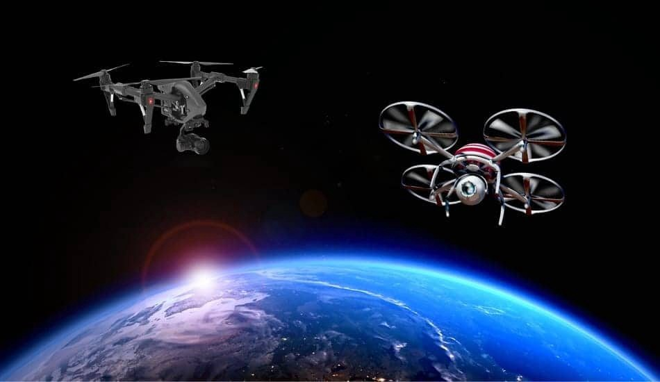
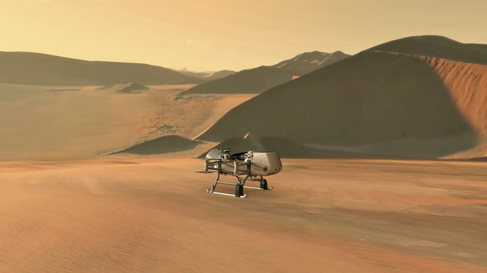
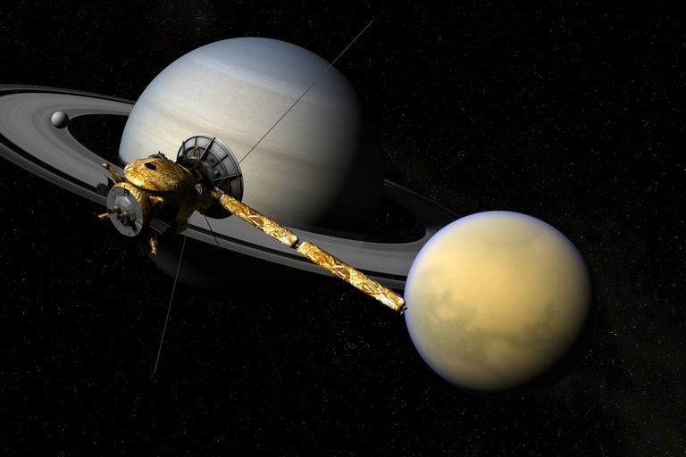

The only technology which has a huge fan following, and is considered as boon for the society, “THE DRONE”. Drone has covered almost all the segments of the Earth, now the question arises, can we break the bars? Can we reach a record breaking height? Well the answer is YES. We can reach a position where no one has reached till now. It’s a dream for all the tech lovers to see the drones in the space. Drone has mastered its skills in almost all the background, so its time to upgrade the level by reaching new heights.

### Barriers till now:

Past many years, organizations like NASA have been trying there level best to send drones at the heights, but there are many factors which pulled them down. Drones which are used on Earth can’t be used the same way in space, because we can’t push air over there.

### Reasons why drones can’t fly in space:

1. Lack of air push.
2. Lack of movement.
3. Lack of powerful engine.
4. Drones can’t work in vacuum.
5. Propellers can’t work.
   Well these are the general reasons… now moving on to the detailed discussion.

### Vacuum:

The biggest question arise that can a drone survive in Vacuum conditions. The answer is NO, because, drones fly (produce lift) by displacing air downwards, but in vacuum due to lack of air in space a drone cannot even move. If we take the example of the rockets they require fuel in bulk to reach escape velocity, for that we require a very heavy engine which can handle such great power. So far, we haven’t developed such kind of drone.

### Density:

The air becomes thinner and thinner when we reach the altitudes, this is one such reason because of which the drone couldn’t reach the heights. Propellers are the devices which help in pushing the air downwards and hence reaching the altitudes, but in space propellers won’t work and the drone might vanish in the space. Taking example of moon, sending a drone to a place where there is low gravity and low air density, this will lead to the instability.

### Engine backup:

Rockets consist of powerful engines which help in tearing the atmosphere, but right now drones are not capable enough to tear the layers of atmosphere and get into the space.

### NASA on Drones:

NASA is trying his level best to come up with a technology which can move in space. Dragonfly is a drone which is planning to leave earth in 2026 and will be reaching “Titan-Saturn’s satellite” in 2034. This 8 year journey will help to explore many untold mysteries… this experience will not only help us to explore the surface of Titan, but also the atmosphere of the space.
Dragonfly is a quadcopter which is focusing upon to tear up the density of the air in the space and reach the surface. Their main focus is to explore the existence of the living beings on titan as it is very similar to Earth. Not only this, but they focusing upon how the outer space works. This 8 year will be very crucial for the future of drones. The drone which they are planning to send is more like a rover.
Other than propellers, NASA is focusing upon using a jet system which will help the drone to navigate and give direction to it. NASA is working on specially designed drones that will be capable of exploring both the universe and planets and collect a variety of data. If this project succeeds, then it will be a huge gift from the technology to the mankind.

### Conclusion:

There are many surprises in the queue, but with surprises there gonna be huge challenges which we have to focus upon. Drone is the only technology which has worked upon to upgrade his own existence. In coming years, drone will surely come up as boon for the society.
Many surprises to come stay tuned!!
For more detailed information you can refer to:<a href= https://www.nasa.gov/subject/9566/unmanned-aircraft>This Link </a>

