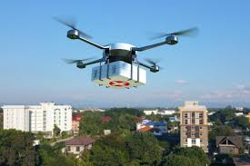
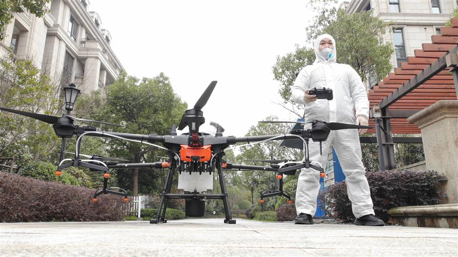
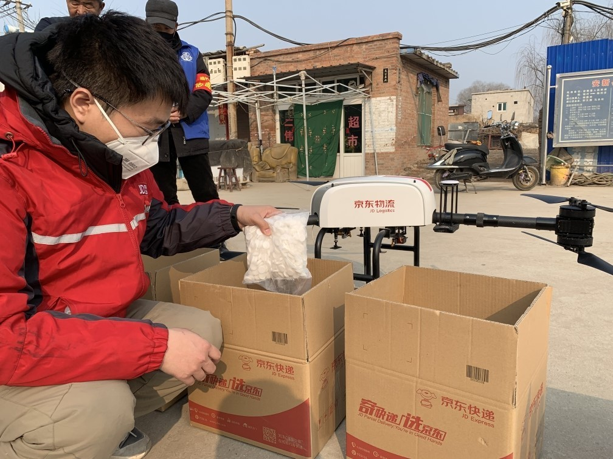
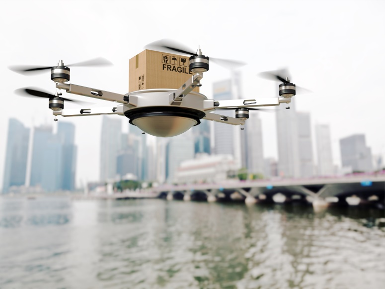

Disinfectant robots, contactless deliveries, supercomputers; the recent worldwide COVID-19 outbreak has not only put the entire human civilization to s sudden halt, but has also put the technology to the biggest test. Amidst the chaos, while the countries are not willing to give on this mind blowing opportunity to showcase how sound they are as far as technology and AI is concerned, the race to stabilize the lockdown situation and to find a cure for this unpredictable virus is a much needed requisite.
Countries around the world are fighting altogether to come up with a cure, the bottleneck of the situation at hand, Wuhan, has been a witness to the deployment of robots to help in the provision of front line medical aid. In the recent times, the slowdown of the alarming pandemic situation in China has been possible majorly due to the usage of AI. The Chinese government is leaving no stone unturned to eradicate the effects of this virus, and has been incorporating drones in their response to this pandemic.

### AUTOMATED STERILIZATION OPERATIONS

Drones have been designed and deployed to spray disinfecting chemicals in some public spaces and on epidemic prevention vehicles traveling between the areas under high impact. As Coronavirus is mainly transmitted via respiratory droplets and can also spread by touching contaminated surfaces, autonomous spraying of these disinfectants helps reduce these mechanisms of transmission.
“Compared with hand spray, drone spray has many advantages in terms of efficiency and consistency,” noted Justin Gong, co-founder of agricultural drone company XAG. Depending on the application, autonomous aerial sterilization has been proved to be 50 times more efficient than manual sterilization, which is restricted to a particular space.
To ensure the safety of these successful aerial disinfection operations, XAG Technologies, DJI Agriculture, China Agricultural Machinery Distribution Association, China Agricultural University Research Centre for Medical Equipment and Application Technology and other relevant agencies jointly published a series of operational methodologies and technical stipulations to communicate with local authorities and make sure that all efforts were conducted in a safe, scientific and autonomous manner, taking precautions and preventing all kinds of human contact.

### TRANSPORTATION OF MEDICAL SUPPLIES AND CONSUMER DELIVERY SERVICES

Along with this, the autonomous transportation of medical supplies has significantly reduced unnecessary human contact and prevented the secondary transmission of the virus, proving to be a win-win situation for the authorities, cutting down the manual effort and conveyance time by half, even more.
Other than medical supplies, the drone delivery mechanism had proved to be the most feasible alternative, giving people access to the basic requirements and necessities and preventing human contact at the same time. Various e-commerce companies have designed and deployed their own drone teams to carry out these deliveries, without any hurdles passed on by the types of terrain, which is the best alternative as far as the situation-at-hand is concerned. These drone teams conduct ground surveys, design flight corridors, request airspace access permission and conduct final flight tests. Within the next few days of public airspace access, these drone delivery corridors are put in place replacing hours-long drives with a 2 km flight that can be completed in the time span of just 10 minutes.

### LESSONS LEARNT

The use of drones and autonomous UAVs and MAVs have reshaped how we protect and care for our people during such outbreaks and medical emergencies.
World’s COVID-19 outbreak has led to significant trialing with a number of technical experimentations including drones and UAVs. While these experimentations are still in their budding phases, the world needs to draw conclusions and learn how to deal with such deadly emergencies.
Drones need to be assimilated into planned health responses. As the results from Coronavirus response efforts in China to blood delivery in Rwanda and Ghana to Dengue prevention in Fiji become clearer, we should be able to preplan how drones will be used during disease outbreaks and make appropriate investments rather than relying on ad hoc methodologies.
The data associated with the impact of these new experimentations needs to be gathered so that the conclusions regarding these emergencies and the ways to prevent these from happening can be drawn. This data is often considered to be exclusive by companies and sensitive by authorities. Hence, privatization of these firms can be one of the factors to promote these experimentations. But a commitment by authorities to release this information or a trusted neutral party with access to the data could ensure other health systems to be able to learn from these experiences.

